# FNSS - Arduino Pin Kontrol ve İzleme Uygulaması


## Proje Tanımı

Bu repo, Arduino tabanlı projelerde dijital ve analog pinlerin merkezi bir GUI üzerinden yönetilmesini sağlayan açık kaynaklı bir masaüstü uygulamasıdır. Kullanıcı dostu arayüzü sayesinde pinlerin anlık durumu izlenebilir, yazma/okuma işlemleri gerçekleştirilebilir ve otomatikleştirilmiş desenler (pattern) uygulanabilir.

Bu proje, **FNSS Savunma Sistemleri A.Ş.** bünyesinde staj yaptığım süre boyunca tarafımdan (@ahmetrft) geliştirilmiştir.

## 🚀 Özellikler

### 🔌 Pin Kontrolü
- **Dijital Pinler (2-13):** Her pin için aç/kapat toggle anahtarı
- **PWM Pinler (3, 5, 6, 9, 10, 11):** 0-255 arası hassas PWM kontrolü
- **Analog Pinler (A0-A5):** Hem dijital hem analog modda kullanım
- **Anlık Görsel Geri Bildirim:** Toggle butonları canlı renk güncellemesi (Yeşil: Açık, Kırmızı: Kapalı)

### 📊 Gerçek Zamanlı İzleme
- **Dijital Okuma:** Pin durumlarını renkli göstergelerle takip et
- **Analog Okuma:** A0-A5 pinlerinden 0-1023 arası değerleri anlık görüntüle
- **Özelleştirilebilir Okuma Hızı:** Dijital ve analog okuma için ayrı ayrı zamanlama
- **Otomatik Senkronizasyon:** Arduino'dan gelen yanıtlarla görsel durumlar senkronize

### 🎭 Otomatik Patternler
- **Sıralı Pattern:** Pinleri sırayla aç/kapat (dalga efekti)
- **Blink Pattern:** Her pin için sırayla aç-kapat (sıralı yanıp sönme)
- **Hepsi Pattern:** Tüm pinleri aynı anda aç/kapat (senkronize yanıp sönme)
- **Özelleştirilebilir Hız:** Her pattern için ayrı ayrı zamanlama ayarı
- **Anlık Kontrol:** "Hepsi Açık" ve "Hepsi Kapalı" butonları ile toplu kontrol

### ⚙️ Konfigürasyon Sistemi
- **Pin Modları:** Her pin için INPUT/OUTPUT/PASIF mod seçimi
- **Pin Türleri:** Digital/PWM (dijital pinler), Analog/Digital (analog pinler)
- **Toplu Ayarlar:** "Tümü Okuma", "Tümü Yazma" butonları
- **Varsayılana Döndür:** Tek tıkla fabrika ayarlarına sıfırlama
- **Otomatik Kaydetme:** Değişiklikler anında kaydedilir

### 🔧 Serial Haberleşme
- **Otomatik Port Bulma:** Arduino portunu otomatik tespit
- **Manuel Bağlantı:** İstenilen port ve baudrate ile bağlantı
- **Serial Monitor:** Gönderilen/alınan mesajları canlı izleme
- **Mesaj Geçmişi:** Serial monitör açıldığında önceki mesaj sayılarını gösterme
- **Bağlantı Durumu:** Gerçek zamanlı bağlantı durumu takibi

### 🎨 Modern Arayüz
- **CustomTkinter:** Modern, güzel görünümlü arayüz
- **Responsive Tasarım:** Pencere boyutuna uyumlu layout
- **Renk Kodlaması:** Mesaj türlerine göre renkli gösterim
- **Otomatik Kaydırma:** Yeni mesajlar için otomatik scroll
- **Zaman Damgaları:** İsteğe bağlı zaman damgası gösterimi

## 🛠️ Kurulum

### 1. Projeyi İndirin
```bash
git clone https://github.com/ahmetrft/FNSS.git
cd FNSS
```

### 2. Gerekli Paketleri Yükleyin
```bash
pip install -r requirements.txt
```

### 3. Arduino Kodunu Yükleyin
- `src/arduino_codes/test_real/Test_real.ino` dosyasını Arduino IDE'de açın
- Arduino board'unuza yükleyin
- USB ile bilgisayara bağlayın

### 4. Uygulamayı Başlatın
```bash
python src/main.py
```

## 🎮 Kullanım Kılavuzu

### Ana Pencere
Uygulama başlatıldığında ana pencere açılır. Buradan diğer modüllere erişebilirsiniz:

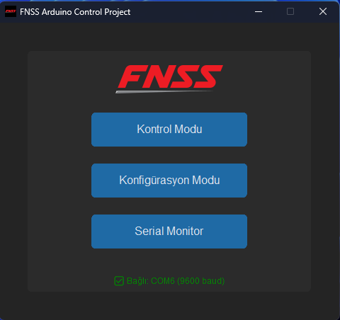

_Ana menü genel görünüm_

- **Kontrol Modu:** Pin kontrolü ve patternler
- **Konfigürasyon Modu:** Pin ayarları
- **Serial Monitor:** Haberleşme izleme

### Kontrol Modu
1. **Pin Kontrolü:** Toggle butonları ile pinleri aç/kapat
2. **PWM Kontrolü:** Slider ile PWM değerini ayarla (0-255)
3. **Patternler:** 
   - Sıralı: Pinleri sırayla aç/kapat
   - Blink: Her pin için sırayla aç-kapat
   - Hepsi: Tüm pinleri aynı anda aç/kapat
4. **Okuma:** Dijital ve analog pinleri otomatik oku

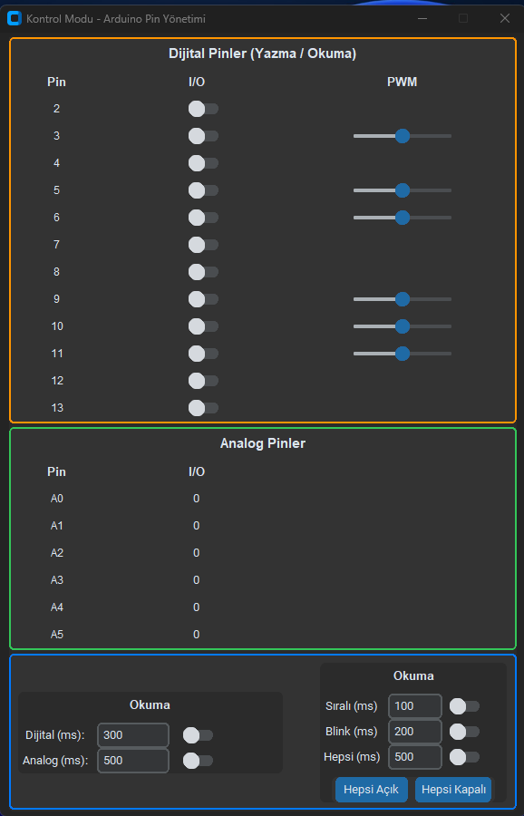

_Kontrol modu genel görünüm_

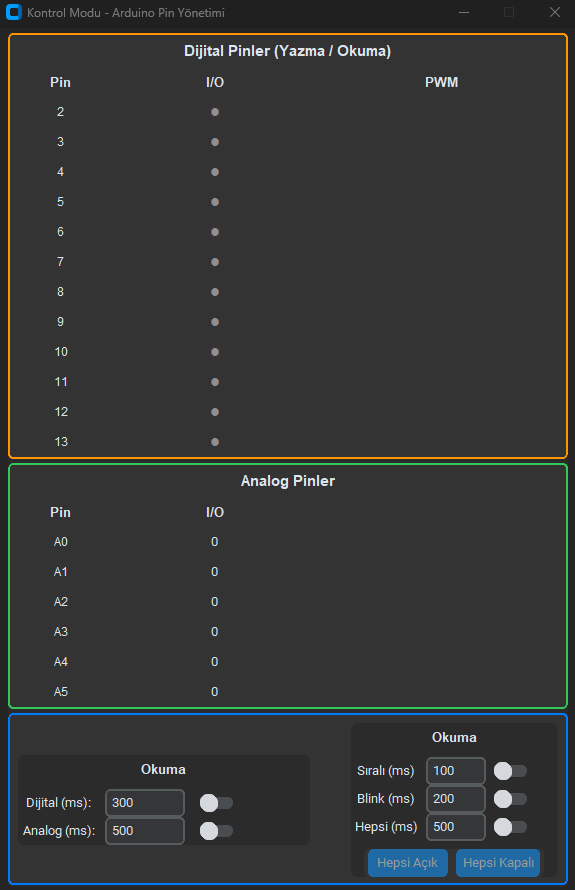

_Tüm pinleri okuma işlemi_

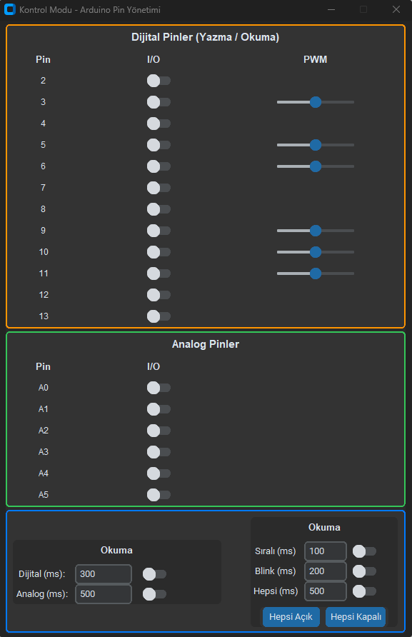

_Tüm pinleri yazma işlemi_

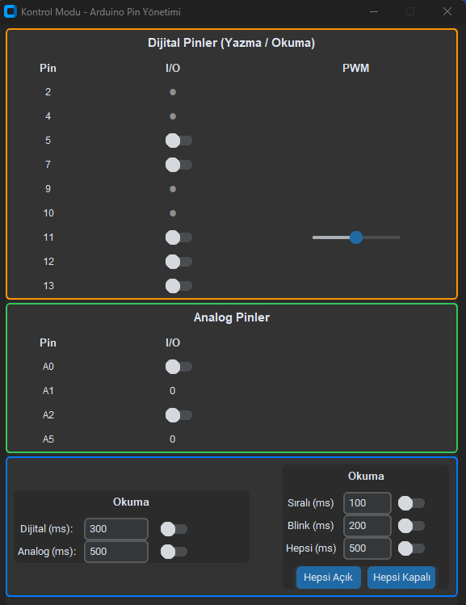

_Kullanıcıya özel pin ayarı_

### Konfigürasyon Modu
1. **Pin Aktif/Pasif:** Her pin için aktif/pasif toggle
2. **Pin Modu:** INPUT/OUTPUT seçimi
3. **Pin Türü:** Digital/PWM (dijital), Analog/Digital (analog)
4. **Toplu İşlemler:** Tüm pinleri aynı anda ayarla

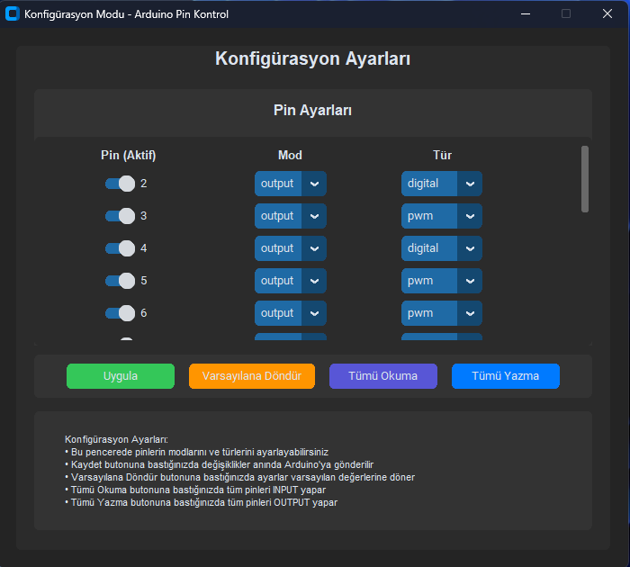

_Konfigürasyon ekranı_

### Serial Monitor
1. **Port Seçimi:** Arduino portunu seç
2. **Bağlantı:** Connect butonu ile bağlan
3. **Mesaj İzleme:** Gönderilen/alınan mesajları gör
4. **Mesaj Gönderme:** Manuel mesaj gönder

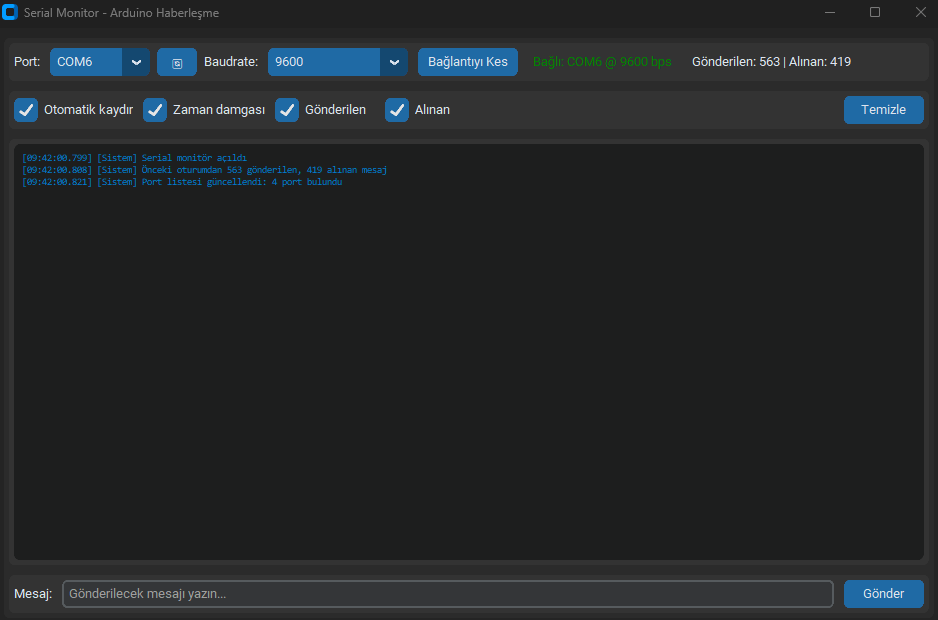

_Serial monitor genel görünüm_

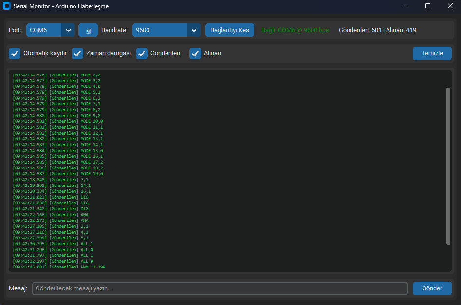

_Aktif veri trafiği örneği_

### Simülasyon ve Proteus
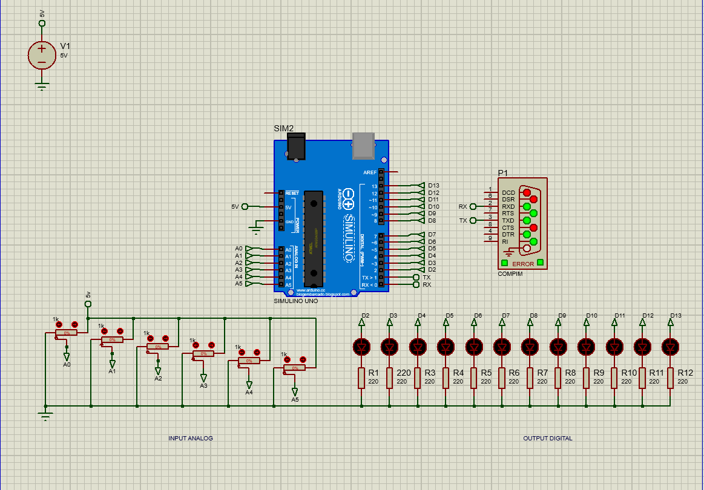

_Proteus devre şeması_

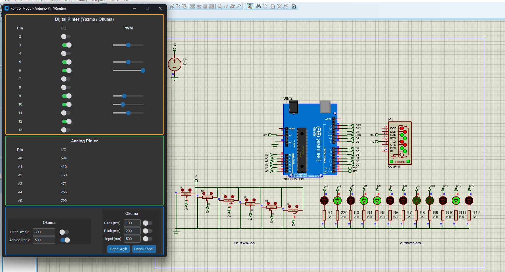

_Simülasyon genel görünüm_

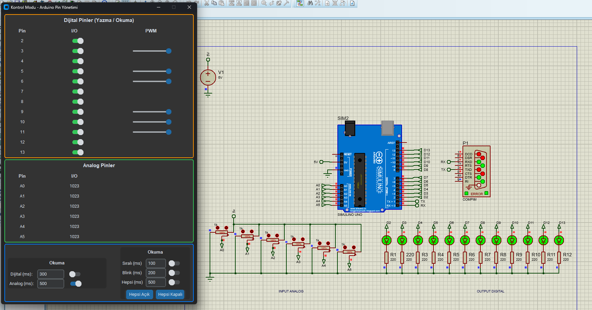

_Tüm pinler açık simülasyon_

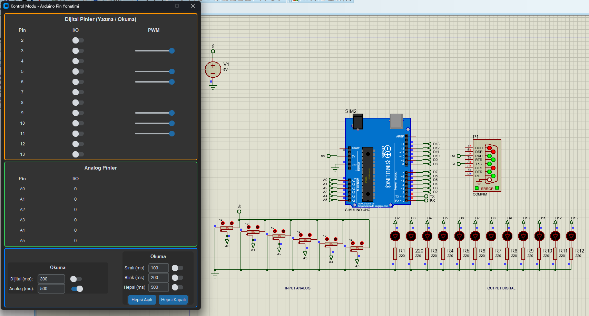

_Tüm pinler kapalı simülasyon_

### Patternler için Akış Diyagramı

Aşağıda, uygulamada bulunan üç temel patternin (desenin) akış mantığı görselleştirilmiştir:

- **Sıralı Pattern:** Pinler sırayla açılır ve kapanır (dalga efekti)

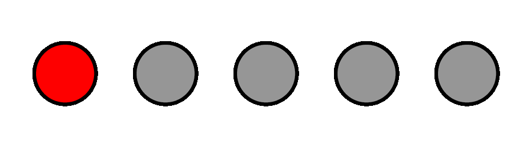


- **Blink Pattern:** Her pin sırayla açılıp kapanır (yanıp sönme)


- **Hepsi Pattern:** Tüm pinler aynı anda açılır/kapanır (senkronize)


## 📁 Proje Yapısı

```
FNSS/
├── src/
│   ├── main.py                 # Ana uygulama başlatıcı
│   ├── gui/                    # Arayüz modülleri
│   │   ├── main_window.py      # Ana pencere
│   │   ├── control_menu.py     # Kontrol modu
│   │   ├── config_menu.py      # Konfigürasyon modu
│   │   └── serial_monitor.py   # Serial monitör
│   ├── core/                   # Çekirdek işlevler
│   │   ├── config.py           # Konfigürasyon yönetimi
│   │   ├── pin_manager.py      # Pin işlemleri
│   │   ├── serial_manager.py   # Serial haberleşme
│   │   ├── message_router.py   # Mesaj yönlendirme
│   │   └── scheduler.py        # Zamanlanmış görevler
│   ├── utils/                  # Yardımcı fonksiyonlar
│   │   └── logger.py           # Loglama
│   ├── assets/                 # Uygulama varlıkları
│   └── arduino_codes/          # Arduino kodları
│       ├── test_real/          # Gerçek Arduino kodu
│       └── test_sim/           # Simülasyon kodu
│   └── report/                 # Rapor ve ekran görüntüleri
│       ├── FNSS Arduino Simülasyon Test Projesi Raporu.docx
│       ├── FNSS Arduino Simülasyon Test Projesi Raporu.pdf
│       └── screenshots/        # Ekran görüntüleri ve simülasyon görselleri
├── build_exe.py                # Derleme scripti
├── requirements.txt            # Python bağımlılıkları
├── LICENSE                     # Lisans dosyası
└── README.md                   # Bu dosya
```

## Teknik Terimler ve Açıklamaları

| Terim                | Açıklama                                                                 |
|----------------------|--------------------------------------------------------------------------|
| GUI                  | Grafiksel Kullanıcı Arayüzü                                              |
| Toggle               | Aç/kapat anahtarı (buton)                                                |
| Pattern              | Otomatik desen (belirli bir sırayla yapılan işlem)                       |
| Serial Monitor       | Seri port haberleşmesini izleme ve mesaj gönderme aracı                  |
| PWM                  | Pulse Width Modulation (Darbe Genişlik Modülasyonu)                      |
| Input/Output (Giriş/Çıkış) | Pinin veri alıp vermesiyle ilgili modlar                        |
| Baudrate             | Seri iletişimde veri iletim hızı (bit/saniye)                            |

### Haberleşme Komutları

| Komut                | Açıklama                                      | Örnek                |
|----------------------|-----------------------------------------------|----------------------|
| `PIN,STATE`          | Dijital pin aç/kapat                          | `7,1`                |
| `PWM PIN,VALUE`      | PWM pinine değer yaz                          | `PWM 9,128`          |
| `MODE PIN,MODE`      | Pin modunu ayarla (INPUT/OUTPUT)              | `MODE 7,1`           |
| `ALL STATE`          | Tüm pinleri aynı anda aç/kapat                | `ALL 1`              |
| `DIG`                | Dijital pinleri oku                           | `DIG`                |
| `ANA`                | Analog pinleri oku                            | `ANA`                |
| `STAT`               | Pin durumunu sorgula                          | `STAT`               |

## 🐛 Bilinen Sorunlar ve Çözümler

### Arduino Bağlantı Sorunları
- **Port Bulunamıyor:** Arduino IDE'den port numarasını kontrol edin
- **Baudrate Uyumsuzluğu:** Arduino kodunda 9600 baudrate kullanın
- **Driver Sorunları:** Arduino driver'larını güncelleyin

### Python Paket Sorunları
- **CustomTkinter Hatası:** `pip install --upgrade customtkinter`
- **PySerial Hatası:** `pip install --upgrade pyserial`

## 🤝 Katkıda Bulunma

1. Bu repository'yi fork edin
2. Feature branch oluşturun (`git checkout -b feature/AmazingFeature`)
3. Değişikliklerinizi commit edin (`git commit -m 'Add some AmazingFeature'`)
4. Branch'inizi push edin (`git push origin feature/AmazingFeature`)
5. Pull Request oluşturun

## 📝 Lisans

Bu proje MIT lisansı ile lisanslanmıştır. Detaylar için [LICENSE](LICENSE) dosyasına bakınız.

## 👨‍💻 Geliştirici

**Ahmet Rıfat Karademir**  
[](mailto:deepyellow18@gmail.com)
[](https://github.com/ahmetrft)
[](https://www.linkedin.com/in/ahmetrifatkarademir)

## 🙏 Teşekkürler
**FNSS Savunma Sistemleri A.Ş.** şirketine bu projeyi geliştirme fırsatı verdiği için